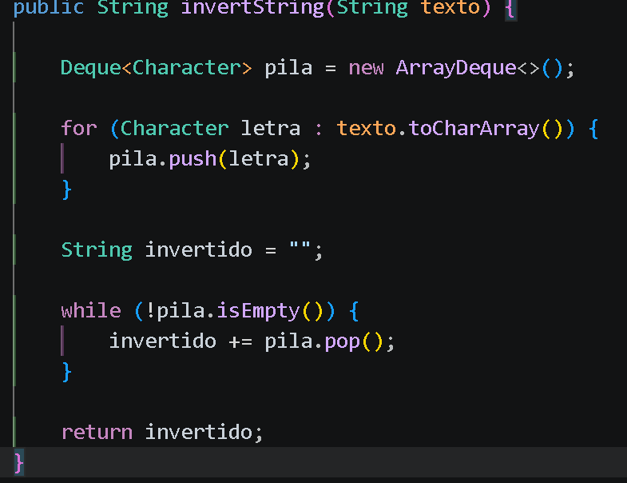
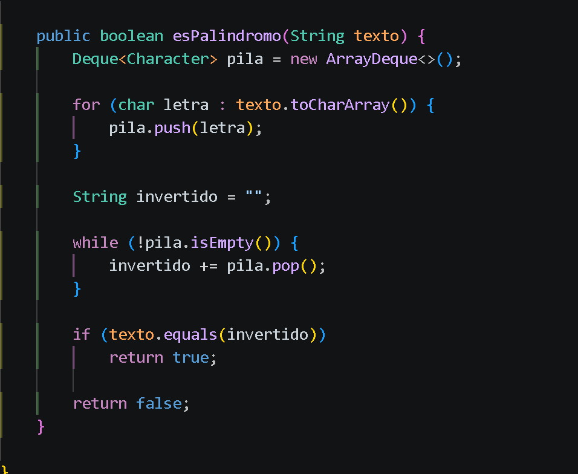

## Practica: Estructuras Dinamicas Líneales
# Datos del Estudiante

    + Nombre: Carlos Tello
    + Curso: Estructura de Datos

# 1. Implementacion de estructuras dinámicas líneales

Fecha: 08 de Junio de 2026

En esta seccion se implementarán las siguientes estructuras dinámicas líneales

    + Listas enlazadas con Linked List
    + Pilas con Stack y Deque
    + Colas con Queue

Ejercicio 1: Invertir un string utilizando pila

## Ejercicio 2: Verificar si una palabra es palíndroma usando pila

Fecha: 10 de Junio de 2026

# Descripcion:

Utiliza una pila para invertir un texto y comprobar si se lee igual de izquierda a derecha que de derecha a izquierda. Si es así, devuelve true; en caso contrario, false.

